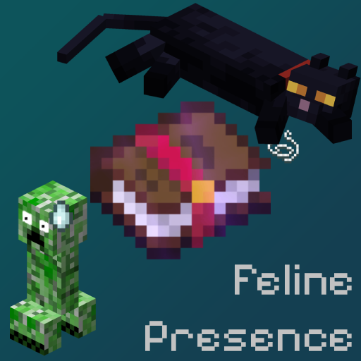

# 🐈‍⬛ Feline Presence

A Minecraft mod by **KeurDeLoup** that introduces the **Feline Presence** enchantment, allowing you to walk among creepers with the grace and safety of a cat.

---

## ✨ Features

### 🐱 Feline Presence Enchantment
*   **Behavior:** Creepers will actively avoid you, fleeing just as they do from Ocelots and Cats.
*   **Application:** Can only be applied to **Leggings**.

## 🐾 How to Find It

*Spending enough time alongside your feline companions may teach you more than you expect.*

### 🎁 Morning Gifts
**Feline Presence** cannot be obtained through enchanting tables, as it is a **Treasure Enchantment**.

Instead, tamed cats have a small chance to gift an **enchanted book** containing **Feline Presence** as part of their **morning gift** behavior.

The more cats you live with, and the luckier you are, the better your chances !

## 💥 Important Note
While **Feline Presence** causes creepers to avoid you, it does **not** make you completely safe.

If you get too close, creepers will still defend themselves and **explode**.  
This enchantment discourages approach, it does not prevent detonation.

---

## 🛠️ Installation

### 🖥️ Client
1. Install [Fabric Loader](https://fabricmc.net/).
2. Download the [Fabric API](https://modrinth.com/mod/fabric-api) and place it in your `mods` folder.
3. Place the `felinepresence-x.x.x.jar` in your `mods` folder.

### ☁️ Server
1. Ensure your server is running **Fabric** (Minecraft 1.21+).
2. Ensure the server is running **Java 21**.
3. Place both **Fabric API** and **KeurDeLoup** in the server's `mods` folder.
4. *Note: Every player joining must also have the mod installed locally.*

---

## 🏗️ Development
Built with the **Fabric Template Mod**.

*   **Namespace:** `felinepresence`
*   **Organization:** `KeurDeLoup`
*   **License:** CC0-1.0 (Public Domain)
*   **Authors:** Soja & Nylium

---
*Created with 🐺 by the KeurDeLoup Team.*
